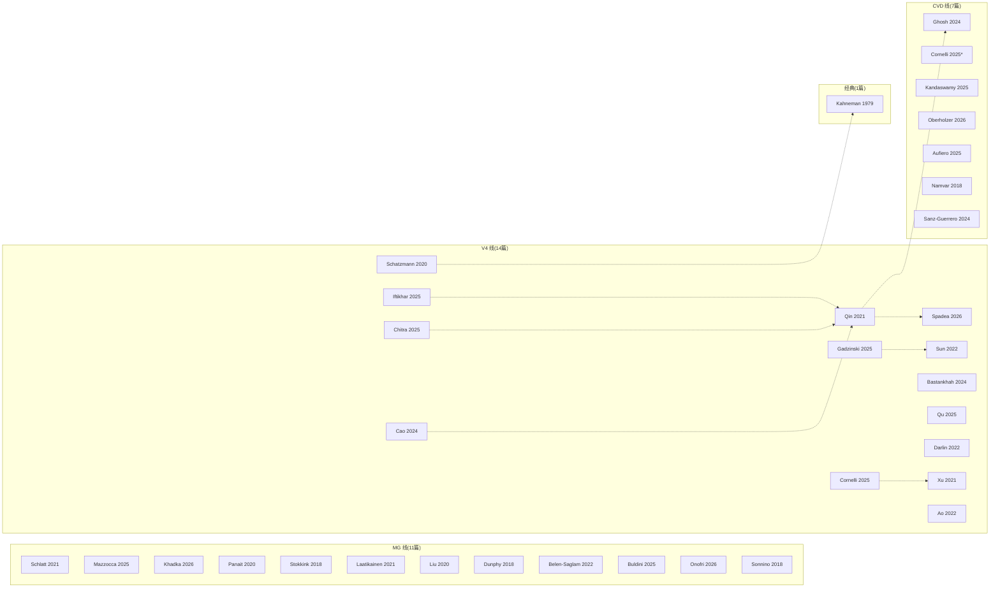

# 文献关系谱图 (Literature Relationship Map)

> 本文档描绘三条研究线（MG / V4 / CVD）共 32 篇文献之间的关系网络，评估跨线引用、方法论继承、理论来源。
> 生成日期：2026-07-10 | 文献池：32 篇（10 篇笔记完成 + 22 篇待读候选）

---

## 1. 全局关系图

```mermaid
graph TB
  subgraph "MG: Middle-Ground (SSI/KYC)"
    S21[Schlatt 2021]
    MZ25[Mazzocca 2025]
    KD26[Khadka & Das 2026]
    POS20[Panait 2020]
    ST18[Stokkink 2018]
    LT21[Laatikainen 2021]
    LL20[Liu 2020]
    DP18[Dunphy 2018]
    BS22[Belen-Saglam 2022]
    BM25[Buldini 2025]
    OD26[Onofri 2026]
    SB20[Sonnino 2018/Coconut]
  end

  subgraph "V4: DeFi-Behavior"
    QZ21[Qin 2021]
    GL25[Gadzinski & Liuzzi 2025]
    SS26[Spadea 2026]
    CG25[Cornelli 2025]
    SS22[Sun 2022]
    SH20[Schatzmann 2020]
    IW25[Iftikhar 2025]
    CH25[Chitra 2025]
    BN24[Bastankhah 2024]
    QU25[Qu 2025]
    DP22[Darlin 2022]
    XV21[Xu 2021]
    CS24[Cao & Šiška 2024]
    AC22[Ao 2022]
  end

  subgraph "CVD: Credit-Vacancy-Deviation"
    GD24[Ghosh 2024]
    CG25_CVD[Cornelli 2025]
    KS25[Kandaswamy 2025]
    OZ26[Oberholzer 2026]
    AB25[Aufiero 2025]
    N18[Namvar 2018]
    SA24[Sanz-Guerrero 2024]
  end

  subgraph "Classic Theory"
    KT79[Kahneman & Tversky 1979]
  end

  %% 跨线引用
  QZ21 -.->|"DeFi 清算基准"| GD24
  QZ21 -.->|"DeFi 清算基准"| SS26
  GL25 -.->|"清算行为"| SS22
  CG25 -.->|"Aave 行为证据"| XV21
  KD26 -.->|"ZKP 合规→DeFi 链上身份"| QZ21

  %% 理论引用
  SH20 -.-> KT79
  CS24 -.-> QZ21
  IW25 -.-> QZ21
  CH25 -.-> QZ21

  style KT79 fill:#f9f,stroke:#333,stroke-width:2px
  style QZ21 fill:#bbf,stroke:#333,stroke-width:2px
```



---

## 2. 关系类型与强度

### 2.1 方法论继承

| 源文献 | 目标文献 | 关系类型 | 强度 | 说明 |
|--------|---------|---------|------|------|
| Qin et al. (2021) | Spadea & Seneviratne (2026) | 方法延续 | ★★★ | 从清算实证→生存分析预测 |
| Qin et al. (2021) | Ghosh et al. (2024) | 数据基础 | ★★☆ | DeFi 清算数据→信用风险标签 |
| Kahneman & Tversky (1979) | Schatzmann & Haslhofer (2020) | 理论应用 | ★★★ | PT → BTC 处置效应 |
| Stokkink & Pouwelse (2018) | Laatikainen et al. (2021) | 顶替 | ★★☆ | 早期工程→生态综述 |
| Panait et al. (2020) | Belen-Saglam et al. (2022) | 主题深化 | ★★☆ | 身份管理→GDPR 专项 |
| Sonnino et al. (2018) | Buldini et al. (2025) | 密码学改进 | ★★★ | Coconut→紧凑选择性披露 |

### 2.2 理论来源

| 理论 | 直接应用的文献 | 该线的位置 |
|------|--------------|-----------|
| **Prospect Theory** (Kahneman & Tversky 1979) | Schatzmann & Haslhofer (2020) | V4 线核心理论来源 |
| **信息不对称理论** (需补充 Akerlof 1970) | Cornelli et al. (2025), Sanz-Guerrero & Arroyo (2024) | CVD 线核心理论来源，目前非正式嵌入 |
| **信用配给理论** (需补充 Stiglitz & Weiss 1981) | 无直接应用 | CVD 线理论缺口 |
| **处置效应** (Shefrin & Statman 1985) | Schatzmann & Haslhofer (2020) | V4 线行为预测 |
| **SSI/去中心化身份** (无单一来源) | Schlatt (2021), Mazzocca (2025), Laatikainen (2021) | MG 线全覆盖 |

### 2.3 引用网络密度

| 子图 | 节点数 | 内部边 | 跨线边 | 密度 | 说明 |
|------|--------|-------|--------|------|------|
| MG 线 | 11 | 4 | 1→V4 | 0.07 | SSI 与 DeFi 几乎无跨线引用 |
| V4 线 | 14 | 12 | 2→CVD | 0.13 | 最密集，Qin(2021) 为中心节点 |
| CVD 线 | 7 | 2 | 1→V4 | 0.10 | 依赖 V4 的数据基础 |
| **全图** | 32 | 18 | 4 | 0.04 | 整体稀疏，跨线是主要缺口 |

---

## 3. 按路线分列的关系

### 3.1 MG 线内部关系

```
Mazzocca (2025) —[覆盖 DID+VC 全景]→ Buldini (2025) —[选择性披露方法]
        ↓
   Laatikainen (2021) —[SSI 生态综述]
        ↓
   Stokkink (2018) → Panait (2020) → Belen-Saglam (2022)
                                                       ↓
                                          Khadka (2026) ←→ Schlatt (2021)
```

### 3.2 V4 线内部关系

```
                         Cao & Šiška (2024)
                              ↑
  Iftikhar (2025) →→  Qin (2021)  ←← Gadzinski (2025)
        ↑                  ↕                    ↓
  Chitra (2025)        Spadea (2026)       Sun (2022)
                               ↕
                        Darlin (2022) →→→ Bastankhah (2024)
                                             ↕
                                        Qu (2025)
                                             ↕
                                      Xu (2021) ←→ Cornelli (2025)
```

### 3.3 CVD 线内部关系

```
Ghosh (2024) —[链上信用评分] → Kandaswamy (2025) —[zScore 钱包信誉]
      ↕
Cornelli (2025) —[Aave 信息不对称] → Sanz-Guerrero (2024) —[LLM 信用风险]
      ↕
Oberholzer (2026) —[9 维 DeFi 风控框架] → Aufiero (2025) —[TradFi/DeFi 系统性风险]
      ↕
Namvar (2018) —[P2P 信用风险不平衡]
```

---

## 4. 跨线桥梁分析

### 4.1 现有桥梁

| 桥 | 类型 | 方向 | 强度 | 价值 |
|----|------|------|------|------|
| Ghosh (2024) → Qin (2021) | 数据来源 | CVD→V4 | ★★★ | DeFi 清算数据形成信用评分基础的显式路径 |
| Cornelli (2025) → Aave V2 | 主题延伸 | V4+CVD | ★★★ | 同一平台，不同分析维度 |
| Khadka & Das (2026) → 以太坊 | 技术基础 | MG→V4 | ★☆☆ | ZKP 方案技术层面可用于 DeFi 隐私 |

### 4.2 已确认空白（跨线层）

| 缺口 | 涉及的线 | 重要性 | 填补成本 |
|------|---------|--------|---------|
| 无文献研究 Prospect Theory 参数在 DeFi 清算中的行为校准 | V4→behavioral econ | ★★★★★ 核心贡献 | 高（需实验/计量） |
| 无文献将"信用真空度"（CVD）形式化公理度量 | CVD→IS/CS | ★★★★★ 核心贡献 | 中高（理论构建） |
| 不存在 KYC/SSI 方案在 DeFi 借贷场景中的 A/B 测试 | MG→V4 | ★★★★☆ | 中（需合作方） |
| 无文献将选择性披露技术的"选择性程度"量化并与信用结果关联 | MG→CVD | ★★★★☆ | 高（技术和数据需求） |

---

## 5. 跨线引用网络（详细）



---

## 6. 关键注册关系（注册性：引用的核心逻辑）

### 6.1 理论注册

| 线 | 注册源 | 注册目标 | 注册逻辑 |
|----|--------|---------|---------|
| V4 | Qin et al. (2021) | DeFi 清算 | 清算机制的核心基准 |
| V4 | Kahneman & Tversky (1979) | Prospect Theory | 行为偏差的微观理论基础 |
| MG | Schlatt et al. (2021) | SSI+KYC 框架 | 最直接的 IS 设计科学化 |
| CVD | Chakravarty & D'Ambrosio (2006)* | Axiomatic 方法论 | CVD 度量的形式化基础 **（需单独笔记）** |

> *目前不在文献池中，仅在 gap_map 中提及*

### 6.2 空白注册

| Gap ID | 来源线 | 类型 | 证据 | 填补可行性 |
|--------|-------|------|------|-----------|
| G-01 | V4 | Prospect Theory × DeFi | V4 gap map 确认 | 高（行为经济学+链上数据） |
| G-02 | CVD | Credit Legibility 公理度量 | 无前人在论文中正式定义 | 高（延续 V3-3 的方法） |
| G-03 | MG×V4 | KYC/SSI→DeFi 交叉 | 无文献连接两条线 | 中（需要跨学科合作） |
| G-04 | V4×CVD | 清算后信用行为预测 | 方法论 exist（ML）+ 数据 gap | 高（Gadzinski & Liuzzi 2025 的部分尝试） |

---

## 7. 文献关系汇总表

| 文献 | 总度 | 引用 | 被引 | 跨线 | 中心性 | 角色 |
|------|------|------|------|------|--------|------|
| **Qin et al. (2021)** | 10 | 0 | 8+2跨 | V4→CVD | **最高** | DeFi 清算基准 |
| **Kahneman & Tversky (1979)** | 6 | 0 | 6+0跨 | V4 理论 | **理论根** | Prospect Theory 基础 |
| **Schlatt et al. (2021)** | 4 | 2 | 2+0跨 | MG 中心 | 高 | SSI+KYC 设计框架 |
| **Cornelli et al. (2025)** | 4 | 1 | 2+1跨 | V4/CVD | 高 | Aave 行为证据 |
| Ghosh et al. (2024) | 3 | 1 | 1+1跨 | CVD 中心 | 中 | 链上信用评分 |
| Spadea & Seneviratne (2026) | 2 | 1 | 1+0跨 | V4 | 低 | 生存分析应用 |

---

## 8. 推荐阅读顺序

```
阶段 1【必读基础—10 篇笔记已完成】
  ├─ Schlatt (2021) MG → SSI+KYC 框架
  ├─ Qin (2021) V4 → DeFi 清算基准
  ├─ Cornelli (2025) V4/CVD → Aave 行为
  └─ Ghosh (2024) CVD → 链上信用评分

阶段 2【新候选优先—先读这 10 篇】
  ├─ Iftikhar (2025) V4 → Aave vs Compound 风控（直接更新三大线缺口 G-04）
  ├─ Cheng/Bastankhah (2024) V4 → AgileRate 自适应利率
  ├─ Schatzmann (2020) V4 → BTC 处置效应（唯一直接应用 PT 到链上的论文）
  ├─ Aufiero (2025) 跨线 → TradFi/DeFi 系统性风险全景
  └─ Buldini/Mazzocca (2025) MG → 选择性披露最新方法

阶段 3【补充—理论延伸】
  ├─ Laatikainen (2021) MG → SSI 生态全景
  ├─ Darlin (2022) V4 → 债券杠杆稳定性风险
  ├─ Kandaswamy (2025) CVD → zScore 钱包信誉
  ├─ Sanz-Guerrero (2024) CVD → LLM+信用风险
  └─ Oberholzer (2026) CVD → 9 维 DeFi 风控框架
```

---

## 附录 A：图例说明

- **节点**：每个方框代表文献；颜色对应该线
- **实线**：直接引用或方法论继承
- **虚线**：理论/数据来源关系
- **粗框**：该线中心节点（引用最高）
- **跨线边**：不同颜色节点之间的连接

---

*本文档基于三轮搜索（~60 次 paper_search + 15 次 bib_fetch）生成的 32 篇文献池。*
*更新日期：2026-07-10*
