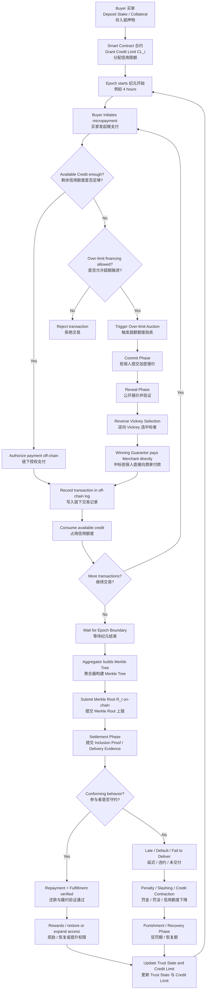
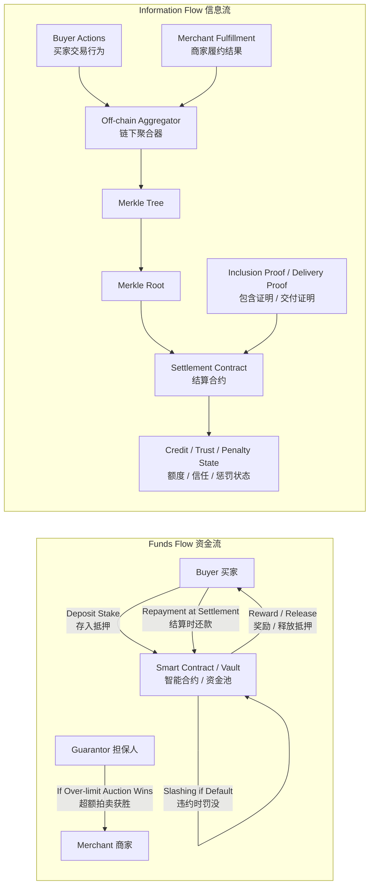
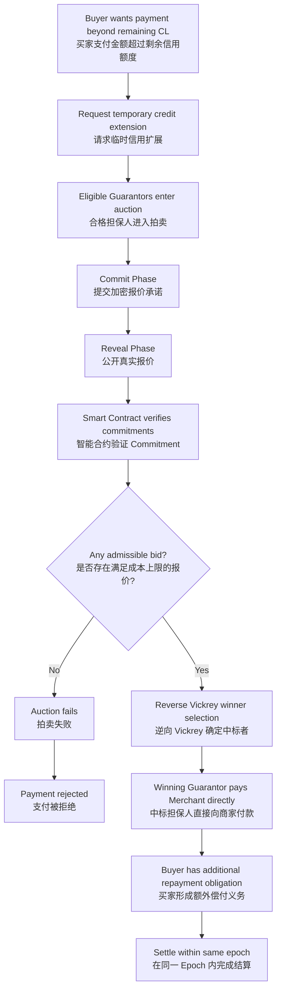
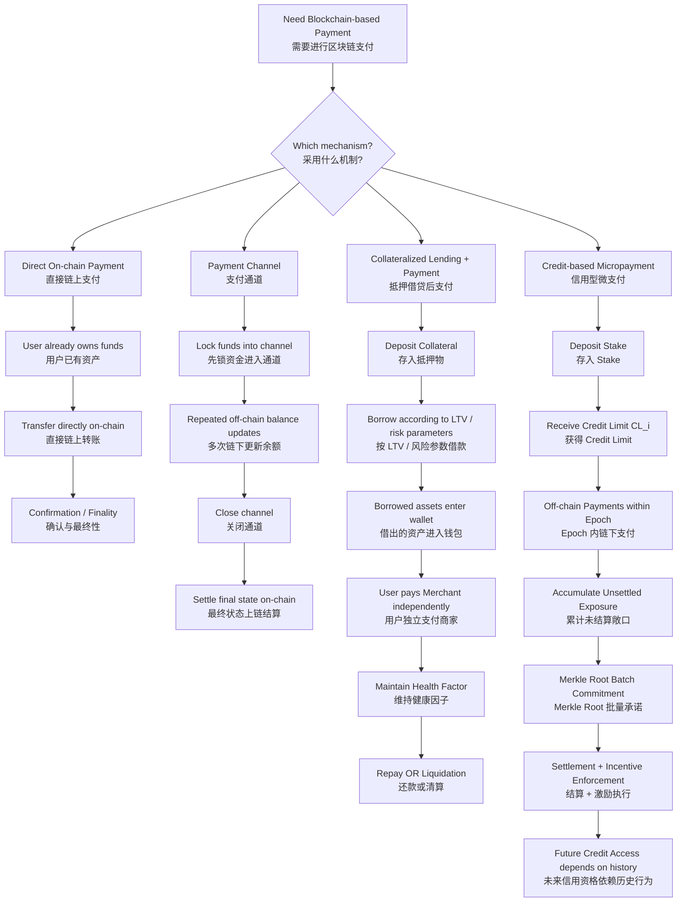
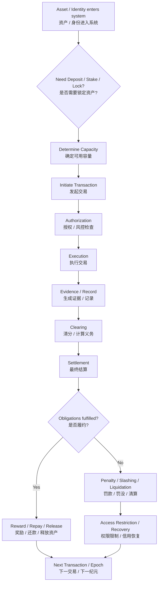
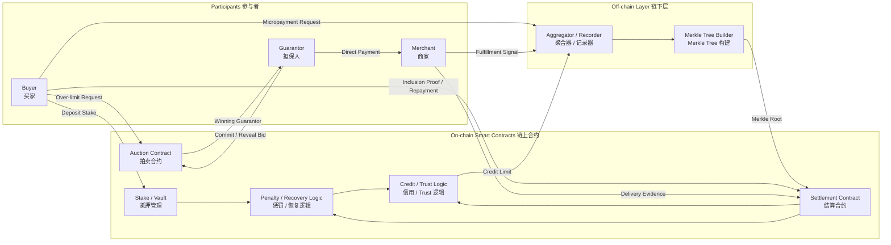

# 区块链上的抵押、信用支付与结算：初学者完整学习版

> 基于论文：**Credit Limits beyond Full Collateralization in Decentralized Micropayments: Incentive Conditions**  
> 作者：Chien-Chih Chen, Wojciech Golab（University of Waterloo）  
> arXiv:2604.25913v1, 2026-04-28  
> 本文重点：帮助初学者理解 **抵押 / 质押（Collateral / Stake）—信用额度（Credit Limit）—支付（Payment）—清分（Clearing）—结算（Settlement）—违约执行（Default Enforcement）** 之间的关系，并理解论文中的 epoch、Merkle Tree、over-limit auction、continuation value 等机制。

---

## 1. 先给出最重要的一句话

这篇论文讨论的不是最普通的：

> 买家点击付款 → 钱立刻从买家钱包转到商家钱包

而是：

> **基于抵押与信用限额的去中心化微支付（decentralized non-custodial credit-based micropayments）**。

它的核心思想是：

**买家先锁一部分抵押物 → 协议给买家一个可能高于抵押额的短期信用额度 → 买家在一个结算周期内持续消费 → 交易先链下记录 → 到 epoch 边界统一证明、结算和执行奖惩。**

因此这里必须把三个动作分开：

1. **Collateral / Stake：抵押 / 质押**
2. **Payment：支付**
3. **Settlement：结算**

它们不是同一个动作。

---

## 2. 为什么这篇论文容易看不懂？[[Credit Limits beyond Full Collateralization in Decentralized Micropayments- Incentive Conditions.pdf]]

因为在日常支付中，我们往往默认：

> 付款 = 钱马上移动 = 交易完成 = 结算完成

但这篇论文故意把这些事情拆开。

在论文设计里：

> **支付行为可以先发生，而最终结算可以稍后发生。**

这更接近现实世界中的：

> 信用卡消费 → 形成账单 → 到期统一还款

而不是：

> 钱包 A → 立刻转账 → 钱包 B

所以学习这篇论文时，必须先建立一个新的思维框架：

```text
抵押 ≠ 支付
支付 ≠ 结算
信用额度 ≠ 钱包余额
Merkle Root ≠ 钱
声誉 ≠ 一个单独的信用评分
Settlement ≠ Liquidation
```

---

# 3. 系统里到底有哪些参与者？

论文中的核心角色可以理解为五类。

### 3.1 Buyer（买家）

买家购买商品或服务。

他可以获得一个协议给予的：

**Credit Limit（信用限额）**

在额度允许范围内进行微支付，而不要求每笔交易立即上链结算。

---

### 3.2 Merchant（商家）

商家提供商品或服务。

商家除了要收钱之外，还必须完成：

- DeliverOnTime：按时交付
- LateDeliver：延迟交付
- FailToDeliver：不交付

协议需要能够通过某种可验证信号判断商家是否履约。

---

### 3.3 Smart Contract / Protocol（智能合约 / 协议）

智能合约负责执行规则，例如：

- 管理 stake / collateral
- 计算或约束信用权限
- 接受 Merkle Root
- 验证 inclusion proof
- 执行 repayment
- 执行 reward
- 执行 penalty
- slash collateral
- 更新 trust state
- 降低或恢复 future credit access

---

### 3.4 Off-chain Aggregator（链下聚合器）

它负责：

- 收集 epoch 内的微支付记录
- 构建 Merkle Tree
- 计算 Merkle Root
- 在 epoch 边界提交 root

非常重要：

> **论文不要求相信 Aggregator。**

它被建模为：

**Untrusted but Verifiable（不可信但可验证）**

也就是说：

> 不相信操作这个服务器的人，但相信可验证的密码学证据。

---

### 3.5 Guarantor（担保人）

担保人不是每笔交易都会出现。

只有当：

> 买家当前剩余 Credit Limit 不够支付一笔交易

但这笔交易仍然位于协议允许的风险边界内时，买家才可能触发：

**Over-limit Auction（超额信用拍卖）**

担保人通过拍卖竞争临时提供流动性。

---

# 4. 最重要的五个概念

## 4.1 Collateral / Stake：抵押 / 质押

这是用户真正锁进协议里的资产。

例如：

```text
Alice deposits 100 USDC
```

表示 Alice 真正锁定：

```text
Stake = 100 USDC
```

如果 Alice 严重违约，协议可能：

```text
slash collateral
罚没抵押物
```

所以 collateral 的基本作用是：

> 为违约提供一个可以真实执行的经济处罚。

---

## 4.2 Credit Limit：信用限额

论文中的：

\[
CL_i
\]

表示买家 \(i\) 在结算之前，最多允许存在多少：

**unsettled value（未结清金额）**

例如：

```text
Stake = 100 USDC
Credit Limit = 300 USDC
```

这里的 300 USDC：

**不是 Alice 钱包里真的多出了 300 USDC。**

而是：

> 协议允许 Alice 在当前结算周期内最多累积 300 USDC 的未结清支付义务。

这是理解论文最关键的一点。

---

## 4.3 Payment：支付

Payment 表示：

> 买家产生一笔对商家的付款行为或付款义务。

普通链上支付可能是：

```text
Alice Wallet
   ↓
ERC-20 Transfer
   ↓
Merchant Wallet
```

但论文中的 credit-based micropayment 更像：

```text
Alice 发起消费
   ↓
协议检查 Credit Limit
   ↓
允许交易
   ↓
形成 unsettled obligation
   ↓
稍后统一 settlement
```

因此：

> Payment 不一定意味着这一刻就已经完成最终链上资金结算。

---

## 4.4 Settlement：结算

Settlement 表示：

> 对之前产生的付款义务进行最终确认和履行。

包括：

- 判断交易是否有效
- 买家是否还款
- 商家是否履约
- 是否罚款
- 是否 slash
- 是否更新信用权限
- 是否恢复 / 提升额度

因此：

```text
Payment = 产生支付或付款义务
Settlement = 最终消除和处理这些义务
```

---

## 4.5 Liquidation / Slashing：清算 / 罚没

这两个概念不要和 Settlement 混淆。

### Settlement

是：

**正常完成债务和状态结算。**

### Liquidation

更多出现在 Aave / Compound 等抵押借贷协议中：

> 当债务仓位风险过高时，第三方清算抵押品。

### Slashing

更多表示：

> 因违反协议规则直接没收一部分或全部 stake。

所以：

```text
Settlement ≠ Liquidation
Settlement ≠ Slashing
```

Liquidation / Slashing 是某些异常状态下的 enforcement。

---

# 5. Payment、Clearing、Settlement、Liquidation 的区别

这是区块链金融中非常重要的一组概念。

## Payment（支付）

发生了一笔付款行为。

---

## Clearing（清分 / 清算计算）

主要解决：

> 谁欠谁多少钱？

例如 4 小时内发生：

```text
Alice → Merchant A = 20
Alice → Merchant B = 30
Alice → Merchant A = 40
```

系统需要先确定：

```text
Alice 总未结清义务 = 90
```

---

## Settlement（结算）

真正履行这些债务。

例如：

```text
Alice repays 90 USDC
```

然后协议：

```text
Outstanding debt → 0
Credit available → restored
```

---

## Liquidation（强制清算）

例如 Aave 中：

```text
抵押物价值下降
        ↓
Health Factor < 1
        ↓
Liquidator 偿还部分债务
        ↓
获得抵押物
```

这是风险处置，不是正常付款流程。

---

# 6. 用一个完整数字例子理解论文

假设 Alice：

```text
Stake = 100 USDC
Credit Limit = 300 USDC
```

这里意味着：

> Alice 用 100 USDC 的真实抵押，获得最高 300 USDC 的结算前支付能力。

因此属于：

**Under-collateralized Credit（不足额抵押信用）**

因为：

\[
100 < 300
\]

---

## 第一笔消费

08:10：

Alice 买咖啡：

```text
Payment = 20 USDC
```

协议检查：

```text
Available Credit = 300
20 <= 300
```

因此：

```text
Approve
```

然后：

```text
Outstanding = 20
Remaining Credit = 280
```

---

## 第二笔消费

08:20：

```text
Payment = 30
```

结果：

```text
Outstanding = 50
Remaining Credit = 250
```

---

## 第三笔消费

09:00：

```text
Payment = 40
```

结果：

```text
Outstanding = 90
Remaining Credit = 210
```

注意：

这里最重要的是：

> 这些数字表示信用额度被占用和付款义务累积，并不意味着每一笔都已经作为独立交易完成最终链上结算。

---

# 7. Epoch 到底是什么？

论文把系统运行时间切成：

**Epoch（结算纪元）**

论文示例：

```text
1 epoch = 4 hours
```

例如：

```text
Epoch t
08:00 ---------------- 12:00
```

这四小时内：

```text
08:10 Transaction 1
08:20 Transaction 2
09:00 Transaction 3
10:15 Transaction 4
11:42 Transaction 5
```

这些交易可以主要在链下处理。

然后：

```text
12:00
Epoch Boundary
```

系统统一进入：

**Settlement（结算）**

---

# 8. 为什么不把每笔交易直接上链？

假设一个 epoch 有：

```text
1000 transactions
```

如果每笔交易都上链：

```text
Tx1 → blockchain
Tx2 → blockchain
Tx3 → blockchain
...
Tx1000 → blockchain
```

意味着：

- 大量 gas
- 大量链上数据
- 低效率
- 不适合 micropayment

论文选择：

```text
1000 transactions
      ↓
Merkle Tree
      ↓
1 Merkle Root
      ↓
Blockchain
```

也就是说：

> 不是把所有交易逐笔提交，而是提交一份能够代表整个交易集合的密码学承诺。

---

# 9. Merkle Tree 到底是什么？

假设只有 4 笔交易：

```text
Tx1
Tx2
Tx3
Tx4
```

先 hash：

```text
H(Tx1)
H(Tx2)
H(Tx3)
H(Tx4)
```

继续组合：

```text
H12 = H(H(Tx1), H(Tx2))
H34 = H(H(Tx3), H(Tx4))
```

最后：

```text
Root = H(H12, H34)
```

得到：

**Merkle Root**

它可以理解为：

> 这一整个交易集合的“加密指纹摘要”。

---

# 10. Inclusion Proof 是什么？

假设 Alice 要证明：

> Tx3 的确属于这个 epoch。

不需要把整个 1000 笔交易提交链上。

只需要：

```text
Tx3
+
Merkle Inclusion Proof
```

智能合约就能计算：

```text
Tx3
 ↓
Hash
 ↓
沿 Merkle 路径重新计算
 ↓
得到 Root'
```

如果：

```text
Root' = On-chain Root
```

则说明：

> Tx3 确实属于之前已经承诺的那一批交易。

这就是：

**Merkle Inclusion Proof（默克尔包含证明）**

---

# 11. “链下聚合器不可信但可验证”到底是什么意思？

论文非常重要的一条原则：

**Off-chain execution is untrusted but verifiable.**

它不是说：

> Aggregator 很可信，所以它提交什么都相信。

而是：

> Aggregator 可以是恶意的，但凡是要影响协议状态的东西，都必须能够被链上证明。

所以：

```text
Aggregator says:
“Tx123 exists”
```

协议不会直接相信。

协议要求：

```text
Tx123
+
Merkle Inclusion Proof
```

验证通过：

```text
Accepted
```

验证失败：

```text
No protocol effect
```

论文甚至明确规定：

> 没有有效 inclusion proof 的交易不能影响 settlement、reward、penalty 或 credit state。

所以可以记成：

> **Trust the proof, not the operator.**

---

# 12. “声誉”为什么不是传统意义上的 Reputation Score？

论文明确强调：

> Reputation 只是一个概念性描述，并没有单独建立一个类似“信用评分 800 分”的模块。

系统真正用到的是：

- public observable history
- trust state \(T_{i,t}\)
- penalty state
- future access
- continuation value

因此：

```text
过去守约
  ↓
保持高信用权限
  ↓
未来继续享受低资本占用
  ↓
未来交易机会有价值
```

反之：

```text
违约
 ↓
罚没 Stake
 ↓
Credit Limit 降低
 ↓
账号 suspension
 ↓
credential revocation
 ↓
重新建立信用很慢
```

所以“声誉”是这些机制共同产生的经济效果。

---

# 13. Continuation Value 是整篇论文最关键的概念

假设：

```text
Stake = 100
Outstanding Debt = 200
```

Alice 如果现在违约：

```text
欠款 = 200
被没收 collateral = 100
```

单纯从当期看：

```text
Alice 可能净得到 100 的违约收益
```

所以：

> 100 collateral 并不能完全覆盖 200 debt。

如果系统只依赖抵押：

**Alice 有可能选择 Default。**

所以论文加入：

**Continuation Value（延续价值）**

含义是：

> 如果 Alice 今天守约，她未来还能继续使用协议、获得信用额度、减少资本锁定，并继续交易。

如果违约：

```text
Future credit access ↓
Privileges ↓
Trust state ↓
May enter punishment
May require restitution
May need identity credential
May rebuild credit slowly
```

因此 Alice 比较：

```text
今天赖账赚多少
          VS
未来损失多少
```

如果：

```text
未来损失 > 当前违约收益
```

那么理性 Alice：

```text
Repay
```

而不是：

```text
Default
```

---

# 14. 论文的买家激励核心公式

论文给出一个临界折现因子：

\[
\underline{\delta}
=
\frac{v_{\max}-S_i^B}
{v_{\max}-S_i^B+\bar u_i}
\]

其中：

- \(v_{\max}\)：单个 epoch 允许的最大未结算敞口
- \(S_i^B\)：买家抵押物
- \(\bar u_i\)：未来继续参与协议每期获得的价值
- \(\delta\)：买家对未来价值的重视程度

如果：

\[
\delta \ge \underline{\delta}
\]

论文证明存在一个守约的：

**Perfect Public Equilibrium（PPE，完美公共均衡）**

直觉非常简单：

> 只要用户足够重视未来继续使用协议的价值，他就不会为了当前一次违约收益而牺牲未来资格。

---

# 15. 为什么必须限制 Bounded Exposure？

论文规定：

\[
v_{i,t} \le v_{\max}
\]

即：

**Bounded Aggregate Exposure（总敞口有界）**

原因非常直接。

如果系统允许：

```text
Stake = 100
Credit = 无限
```

那么 Alice 理论上可以欠：

```text
1000
10000
100000
...
```

那么未来信用价值再高，也可能无法覆盖一次巨大违约收益。

因此必须：

```text
Maximum Outstanding Exposure
=
有限
```

这实际上是在给系统的最大单次损失设置上限。

---

# 16. Identity Friction 为什么非常重要？

假设 Alice 违约之后：

```text
Old Wallet blocked
```

但 Alice 可以立即：

```text
Create New Wallet
```

然后：

```text
New Wallet immediately receives same 300 credit limit
```

那么 Alice 会想：

```text
我为什么不违约？
```

因为：

```text
违约 → 换地址 → 马上重新获得同样额度
```

Continuation Value Loss：

```text
≈ 0
```

这时论文的买家激励机制就崩溃了。

因此论文要求某种：

**Identity Friction（身份重建摩擦）**

例如：

- credential
- conservative initial credit limit
- restitution
- waiting period
- trust rebuilding
- rate-limited credit recovery

不一定要求真实实名身份永久绑定。

真正要求的是：

> 违约用户不能零成本立刻获得和以前完全一样的信用能力。

---

# 17. Merchant 商家侧为什么和 Buyer 不一样？

Buyer 的最大问题：

> 不足额抵押意味着 Default 可能在当期有利。

所以需要未来价值约束。

Merchant 的逻辑不同。

商家有三个动作：

```text
DeliverOnTime
LateDeliver
FailToDeliver
```

论文希望实现：

\[
DeliverOnTime
>
LateDeliver
>
FailToDeliver
\]

也就是：

> 按时交货最好，晚交货次之，直接跑路最差。

---

# 18. 商家为什么不能随便拖延？

如果商家延迟交货，可以暂时获得某些机会收益：

\[
\Psi_{j,k}
\]

论文要求 late penalty：

\[
P^{LM}_{j,k}
>
\Psi_{j,k}
\]

于是：

```text
拖延获得的好处
<
拖延受到的罚款
```

那么商家理性选择：

```text
DeliverOnTime
```

而不是：

```text
LateDeliver
```

---

# 19. 商家违约为什么也会被抑制？

商家如果完全不履约：

```text
FailToDeliver
```

会触发：

- penalty
- stake consequences
- reward loss
- punishment state

因此协议通过参数设置，让：

```text
LateDeliver > FailToDeliver
```

再结合：

```text
DeliverOnTime > LateDeliver
```

最终：

```text
DeliverOnTime
>
LateDeliver
>
FailToDeliver
```

---

# 20. 但协议怎么知道 Merchant 真的交货了？

这是论文非常重要的边界条件。

对于：

```text
20 USDC transfer
```

区块链可以直接看到：

```text
address A → address B
```

但它并不知道：

```text
这 20 USDC 是买咖啡？
还款？
送礼？
买 API 服务？
公司内部转账？
```

更不知道现实世界里的：

```text
咖啡有没有送到
包裹有没有送到
维修有没有完成
```

因此论文要求：

**Verifiable Public Signal \(y_t\)**

例如：

- cryptographic delivery acknowledgment
- logistics oracle
- digitally logged service completion
- dispute-resolution output

所以：

```text
Blockchain
可以验证某个 signal
```

不等于：

```text
Blockchain 天然知道现实世界发生了什么
```

这一点对链上行为研究非常重要。

---

# 21. 链上能看到 Transaction，但不一定能看到 Purpose

这是一个非常重要的研究结论。

如果你只观察：

```text
0xAlice
   ↓
100 USDC
   ↓
0xBob
```

你可以比较确定：

> 发生了一次资产转移。

但通常不能直接确定：

> 为什么转？

也就是：

```text
WHAT / WHY
```

未必可观测。

只有协议把业务语义编码进去，例如：

```text
repayLoan()
settleInvoice()
depositCollateral()
liquidate()
swapExactTokens()
claimReward()
```

或者：

```text
event LoanRepaid(...)
event MerchantPaid(...)
```

你才能从：

**Contract Call + Event + State Transition**

推断更多 economic purpose。

所以：

> 链上研究不能简单把 Transfer History 等同于完整经济行为历史。

---

# 22. Over-limit Auction 是什么？

继续使用 Alice 的例子。

假设：

```text
Credit Limit = 300
Already Used = 280
Remaining = 20
```

现在 Alice 想支付：

```text
50 USDC
```

缺口：

```text
50 - 20 = 30
```

正常逻辑应该：

```text
Reject
```

但论文允许在特定风险范围内：

```text
Trigger Over-limit Auction
```

即：

**超额信用拍卖**

---

# 23. 为什么要引入 Guarantor？

因为 Alice 已经没有足够 Credit Limit。

如果协议自己继续无限扩张信用：

```text
Protocol exposure ↑
```

风险会快速上升。

因此：

> 让第三方资金提供者竞争提供临时信用。

例如：

```text
G1: 愿意提供资金，成本 2%
G2: 愿意提供资金，成本 1.5%
G3: 愿意提供资金，成本 2.2%
```

这时通过拍卖决定谁提供资金。

---

# 24. Commit–Reveal 是什么？

如果大家直接公开出价：

```text
G1 = 2%
```

G2 看到以后可能说：

```text
那我 1.99%
```

G3 再看到：

```text
那我 1.98%
```

会带来：

- 抢跑
- 模仿
- 操纵
- 策略性修改报价

所以协议采用两个阶段。

---

## Commit Phase

担保人不公开报价。

而是提交：

```text
Hash(Bid + Salt)
```

例如：

```text
G1 commits H(2% + secret)
G2 commits H(1.5% + secret)
```

别人看不到真实值。

---

## Reveal Phase

之后：

```text
G1 reveals 2% + secret
G2 reveals 1.5% + secret
```

智能合约重新 hash：

```text
H(revealed value + secret)
```

检查是否等于最开始 commitment。

如果相同：

```text
Valid Bid
```

否则：

```text
Invalid
```

---

# 25. 为什么叫 Reverse Vickrey Auction？

普通拍卖通常是：

```text
一个卖家
↓
多个买家竞争
↓
谁愿意支付更高价格
```

但这里反过来：

```text
一个需要融资的 Buyer
↓
多个 Guarantor 竞争提供资金
↓
谁愿意要求更低融资成本
```

所以叫：

**Reverse Auction（逆向拍卖）**

论文使用的是：

**Reverse Vickrey Design（逆向维克里设计）**

---

# 26. 为什么担保人直接向 Merchant 付款？

这是非常关键的机制。

假设：

```text
Guarantor
   ↓
给 Alice 50
```

然后期待：

```text
Alice
   ↓
给 Merchant 50
```

Alice 拿到钱以后可能：

```text
跑路
转给别人
自己花掉
```

所以论文采用：

```text
Guarantor
   ↓
Merchant
```

直接付款。

即：

> **资金不经过 Buyer。**

这样可以降低：

**Fund Diversion Risk（资金挪用风险）**

同时把融资用途锁定在：

> 完成这笔特定 merchant transaction。

---

# 27. 论文完整流程：文字版

整个机制可以按以下顺序理解。

### Stage 1：Deposit

Buyer：

```text
Deposit Stake / Collateral
```

---

### Stage 2：Credit Allocation

Protocol：

```text
Evaluate stake + public history + trust state
```

得到：

```text
Credit Limit CL_i
```

---

### Stage 3：Epoch Starts

例如：

```text
08:00
Epoch t starts
```

---

### Stage 4：Micropayment

Buyer 发起交易。

Protocol 检查：

```text
Current Outstanding + New Payment
<=
Credit Limit ?
```

---

### Stage 5A：额度足够

如果：

```text
YES
```

则：

```text
Authorize
↓
Record off-chain
↓
Consume available credit
```

---

### Stage 5B：额度不足

如果：

```text
NO
```

继续判断：

```text
Is controlled over-limit financing allowed?
```

如果不允许：

```text
Reject
```

如果允许：

```text
Over-limit Auction
```

---

### Stage 6：继续交易

整个 epoch 内：

```text
Tx1
Tx2
Tx3
...
Txn
```

继续累积。

---

### Stage 7：Epoch Boundary

例如：

```text
12:00
```

进入：

```text
Settlement Boundary
```

---

### Stage 8：Merkle Commitment

Aggregator：

```text
Tx1
Tx2
...
Txn
↓
Merkle Tree
↓
Merkle Root R_t
```

提交：

```text
R_t → Smart Contract
```

---

### Stage 9：Verification

需要影响结算的交易提交：

```text
Transaction Data
+
Merkle Inclusion Proof
```

商家履约可能还需要：

```text
Delivery Proof / Public Signal
```

---

### Stage 10：Settlement

合约判断：

```text
Buyer repaid?
Merchant fulfilled?
Delayed?
Default?
```

---

### Stage 11A：守约

如果：

```text
Buyer Repay On Time
+
Merchant Deliver On Time
```

协议：

```text
Rewards
↓
Restore / increase credit access
↓
Update trust state
↓
Next epoch
```

---

### Stage 11B：违约

如果：

```text
Late Pay
Default
Late Delivery
Fail to Deliver
```

协议：

```text
Penalty
↓
Slash collateral
↓
Reduce credit
↓
Suspend access
↓
Punishment / Recovery
```

然后：

```text
重新进入系统
```

但信用恢复受到限制。

---

# 28. 论文专属 Mermaid 主流程



---

# 29. 资金流与信息流分离 Mermaid

这一张非常重要，因为它帮助区分：

> “钱真的在哪里移动”

与：

> “协议只是记录了什么状态”。



---

# 30. Over-limit Auction Mermaid



---

# 31. 不同协议为什么操作流程完全不同？

不要把：

```text
Bitcoin
Ethereum
USDC
Aave
Lightning
Arbitrum
Compound
```

全部看成同一类东西。

它们处在不同层。

例如：

### BTC / ETH / USDC

更多属于：

- asset
- blockchain
- token

---

### Lightning

属于：

**Payment Channel Protocol**

---

### Aave / Compound

属于：

**Lending Protocol**

---

### Arbitrum

主要属于：

**Layer 2 / Rollup Execution Infrastructure**

---

### 本论文机制

属于：

**Application-layer Credit-based Micropayment Mechanism**

论文只是在 Arbitrum Nitro 上实现了 prototype。

这不意味着：

> Arbitrum 原生就自带论文中的信用支付机制。

---

# 32. 第一类：Direct On-chain Payment

最普通的支付：

```text
Alice Wallet
   ↓
20 USDC
   ↓
Merchant Wallet
```

流程：

```text
Create Transaction
↓
Sign
↓
Broadcast
↓
Blockchain Execution
↓
Confirmation / Finality
```

这里通常：

```text
Payment ≈ Settlement
```

因为资产直接完成链上转移。

不需要：

```text
Collateral
Credit Limit
Continuation Value
Over-limit Auction
```

因此非常重要：

> **区块链上的支付并不天然需要抵押。**

---

# 33. 第二类：Payment Channel，例如 Lightning

思路：

```text
先锁资金
↓
建立 Channel
↓
大量链下更新余额
↓
最后关闭 Channel
↓
最终 Settlement
```

例如：

```text
Alice locks 1 BTC
```

之后：

```text
Alice ↔ Bob
```

不断更新 balance state。

它的支付能力主要来自：

**Pre-funded Channel Liquidity（预先注入的通道流动性）**

而不是：

**Under-collateralized Credit**

所以：

```text
Lightning
≠
这篇论文的信用额度
```

---

# 34. 第三类：Over-collateralized Lending，例如 Aave / Compound

流程：

```text
Deposit Collateral
↓
Calculate Borrow Capacity
↓
Borrow Asset
↓
Asset enters wallet
↓
User spends borrowed asset
↓
Debt accrues interest
↓
Repay OR Liquidation
```

例如：

```text
Deposit ETH worth $1500
↓
Borrow 800 USDC
```

之后 Alice 可以：

```text
USDC → Merchant
USDC → DEX
USDC → Friend
USDC → Bridge
```

Aave 主要关心：

```text
Collateral
Debt
LTV
Health Factor
Liquidation
```

并不天然知道：

> Alice 为什么把借来的 800 USDC 花掉。

所以：

**Borrowing 和 Payment 是两个独立动作。**

---

# 35. 第四类：论文中的 Under-collateralized Credit Micropayment

流程：

```text
Stake
↓
Credit Limit
↓
Micropayments
↓
Outstanding Exposure
↓
Merkle Commitment
↓
Settlement
↓
Reward / Penalty
↓
Future Credit Access
```

最大区别是：

```text
Credit Limit
>
Stake
```

可以成立。

也就是说：

> 允许信用额度高于实际抵押物。

这提高：

**Capital Efficiency（资本效率）**

但必须依赖：

```text
Bounded Exposure
+
Verifiable Settlement
+
Continuation Value
+
Identity Friction
+
Protocol Penalties
```

---

# 36. 四种机制 General Mermaid



---

# 37. 以后如何快速读懂任何区块链金融协议？

看到任何新协议时，可以先不要研究复杂代码，而是先问下面几个问题。

## 问题 1：谁先锁钱？

检查：

```text
Buyer?
Merchant?
Borrower?
Liquidity Provider?
Guarantor?
Validator?
```

然后问：

```text
What asset?
How much?
How long?
```

这属于：

**Collateral / Stake Layer**

---

## 问题 2：用户的 Capacity 是怎么来的？

不同协议里的支付 / 借款能力完全不同。

### Direct Payment

```text
Capacity = Wallet Balance
```

### Lightning

```text
Capacity = Channel Liquidity
```

### Aave / Compound

近似：

```text
Capacity = Collateral Value × Risk Parameters
```

### 本论文

近似理解：

```text
Credit Capacity
=
f(
Stake,
History,
Trust State,
Protocol Rules
)
```

---

## 问题 3：超过 Capacity 会发生什么？

### Direct Payment

```text
Insufficient Balance
→ Fail
```

### Lightning

```text
Insufficient Route / Liquidity
→ Fail or find another route
```

### Aave

```text
Borrow capacity exceeded
→ Borrow rejected
```

### 本论文

```text
Credit limit exceeded
→ possible Over-limit Auction
```

---

## 问题 4：交易在哪里执行？

可能是：

```text
L1
L2
Off-chain Server
Payment Channel
Rollup
Sidechain
```

---

## 问题 5：什么证据可以让协议相信交易发生过？

可能包括：

```text
Blockchain Transaction
Event Log
Signature
Merkle Inclusion Proof
ZK Proof
Oracle Signal
State Channel State
```

这一层可以叫：

**Evidence / Verification Layer**

---

## 问题 6：什么时候 Settlement？

可能是：

```text
Immediately
Every Block
At Channel Close
Every Epoch
At Loan Repayment
After Challenge Window
```

---

## 问题 7：Default 怎么处理？

可能是：

```text
Liquidation
Slashing
Late Fee
Collateral Seizure
Credit Contraction
Account Suspension
Credential Revocation
```

---

# 38. General Protocol Reading Framework

以后任何协议都可以按下面的通用流程理解：

```text
Asset / Identity enters system
        ↓
Deposit / Stake / Lock?
        ↓
Determine Capacity
        ↓
Initiate Transaction
        ↓
Authorization
        ↓
Execution
        ↓
Evidence / Record
        ↓
Clearing
        ↓
Settlement
        ↓
        ├── Conform
        │      ↓
        │   Reward / Repay / Release
        │
        └── Default
               ↓
          Penalty / Slash /
          Liquidation /
          Access Restriction
```

对应 Mermaid：



---

# 39. 从 Smart Contract 角度怎么拆？

一个复杂区块链金融系统往往可以拆成以下模块。

## Asset / Vault Contract

负责：

```text
Token custody
Collateral
Stake
Deposit
Withdraw
```

---

## Credit / Risk Logic

负责：

```text
Credit Limit
LTV
Collateral Factor
Borrow Capacity
Health Factor
Exposure Limit
```

---

## Oracle

负责提供：

```text
Asset Price
Delivery Signal
External Event
```

---

## Settlement Contract

负责：

```text
Repayment
Final Settlement
Merkle Root
Proof Verification
State Transition
```

---

## Liquidation / Slashing Logic

负责：

```text
Default Enforcement
Collateral Seizure
Liquidation
Penalty
```

---

## Auction Contract

部分协议才有：

```text
Commit
Reveal
Winner Selection
Settlement
```

---

## Identity / Credential Layer

如果协议涉及不足额抵押信用，可能非常重要：

```text
Credential
Access
Trust
Recovery
Re-entry Cost
```

---

# 40. 论文机制的 General Architecture



---

# 41. 对链上行为研究最重要的提醒

不能简单使用：

```text
Transfer History
```

然后直接认为：

```text
= User Economic Behavior
```

因为：

```text
Transfer
```

通常只告诉你：

- 地址
- 时间
- token
- value
- sender
- receiver

但不一定告诉你：

- Purpose
- Contractual Relationship
- Goods / Service
- Motivation
- Off-chain Agreement
- Repayment Context
- Ownership Relationship

所以研究中应该尽量结合：

```text
Transfer
+
Contract Call
+
Event Logs
+
Protocol State
+
Address Labels
+
Oracle / Settlement Signal
+
Historical Sequence
```

才能获得更接近真实 economic behavior 的解释。

---

# 42. 最后压缩成一个初学者记忆版本

整篇论文最容易记忆的版本是：

> **Alice 先押一小笔钱，协议根据抵押和历史行为给她一个更大的短期信用额度。Alice 在 4 小时 epoch 内可以连续消费，这些交易先不上链逐笔结算，而是在链下记录。到 epoch 结束后，聚合器把这一批交易构造成 Merkle Tree，并把 Merkle Root 提交到链上。之后，任何需要影响结算、奖惩或信用状态的交易，都必须提供有效的 Merkle Inclusion Proof 或其他履约证据。Alice 正常还款，信用额度继续存在甚至提高；Alice 违约，抵押物被罚没，未来信用额度和协议准入受到限制。因为未来继续使用信用系统具有经济价值，所以理性用户可能不愿为了当前一次违约收益而牺牲未来。若 Alice 临时额度不足，则可以触发 over-limit auction，由担保人竞争提供临时资金，而且中标担保人直接向商家付款，资金不经过 Alice。**

整套机制最终希望实现：

```text
Less Collateral
+
Higher Payment Capacity
+
Verifiable Settlement
+
Bounded Risk
+
Incentive-compatible Behavior
```

也就是：

> **减少资金锁定，提高资本效率，同时尽量保持非托管、可验证和激励相容。**

---

# 43. 一句话理解论文真正研究的问题

这篇论文真正的问题不是：

> “区块链能不能付款？”

而是：

> **在没有传统银行和中心化托管人的情况下，如果抵押物少于信用额度，我们究竟需要什么样的可验证结算、风险上限、惩罚机制和未来信用价值，才能让理性参与者仍然选择守约？**

这就是：

**Credit Limits beyond Full Collateralization**

真正要解决的问题。

---

## 来源说明

本学习笔记主要依据用户提供的以下材料整理：

1. **Credit Limits beyond Full Collateralization in Decentralized Micropayments: Incentive Conditions**  
   Chien-Chih Chen, Wojciech Golab, University of Waterloo, arXiv:2604.25913v1, 2026-04-28.

2. 用户整理笔记：  
   **《Credit Limits beyond Full Collateralization in Decentralized Micropayments_去中心化微支付中超越全额抵押的信用限额_CN.md》**

其中关于论文提出的 4 小时 epoch、Merkle Root、untrusted but verifiable aggregator、stake-based credit limit、trust state、continuation value、over-limit auction、commit–reveal、reverse Vickrey、guarantor direct-to-merchant payment、buyer/merchant incentive condition 等内容均以论文及用户整理材料为基础。

关于 Direct On-chain Payment、Payment Channel、Aave / Compound 类型抵押借贷等部分，仅作为帮助理解论文机制差异的通用概念性比较；它们不是该论文提出的协议组件。
