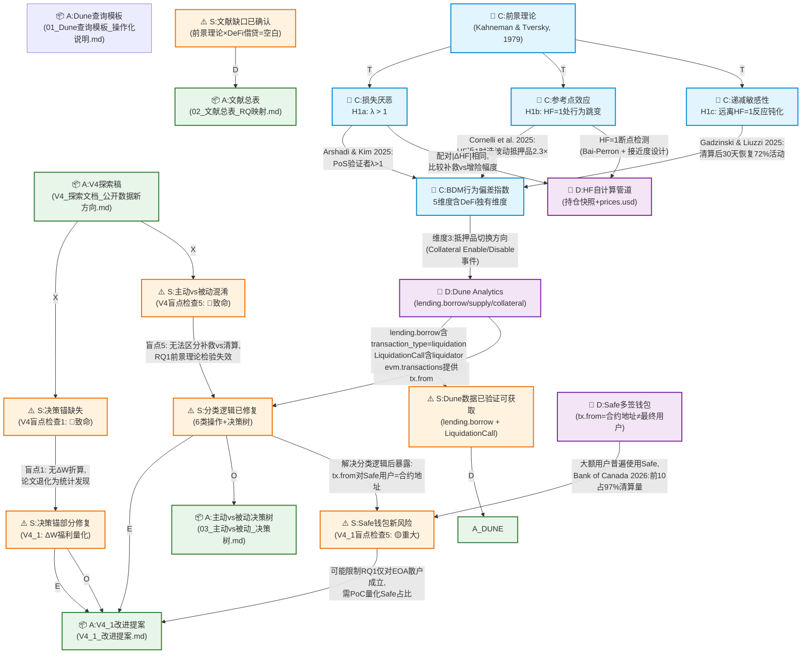

# V4 研究知识图谱 — Demo（核心演化片段）

## 图例

- 🧠 C: 概念节点（理论构念/假设）
- ⚠️ S: 状态/问题节点（盲点/验证状态）
- 📦 A: 产物节点（文件/提案）
- 🔧 D: 数据/工具节点

Edge 标注格式：`[类型] 具体信息`

---

## 子图：V4→V4_1 核心演化

---

## Edge 信息密度说明

每条边必须携带以下信息之一（不能为空）：

| Edge 类型 | 必须信息 | Demo 中的示例 |
|-----------|---------|-------------|
| --T--> 理论支撑 | 作者(年): 具体结论 | "Arshadi & Kim 2025: PoS验证者λ>1" |
| --D--> 数据验证 | 数据源: 验证结果 | "lending.borrow含transaction_type=liquidation" |
| --X--> 致命发现 | 盲点编号: 具体推理 | "盲点1: 无ΔW折算,论文退化为统计发现" |
| --E--> 演化动机 | 驱动力 | "决策锚部分修复→V4_1" |
| --O--> 操作化映射 | 字段/公式 | "维度3: 抵押品切换方向 (Collateral Enable/Disable事件)" |

---

## 设计决策记录

1. **为什么不把文献单独作为节点？** 因为文献的引用总是为了支撑某个具体的推理步骤（edge），文献本身不是我们研究的"概念"。把文献放在 edge 标注中而非独立节点，强制每条引用都必须说明"用这篇文献的什么结论支撑了什么推理"。

2. **为什么状态/问题是一类节点？** 因为研究过程中的关键状态变化（如"盲点发现"、"数据验证通过"）本身是静态事实，但它们对后续路径的影响是动态的。把它们显式化为节点，可以追踪"哪些发现改变了研究走向"。

3. **Safe钱包为什么既是工具节点又是问题来源？** 因为 D:Safe钱包 作为工具是中性的，但它在"主动/被动分类"这个特定操作化路径中制造了测量约束。这个约束通过 edge（而非节点属性）表达。
